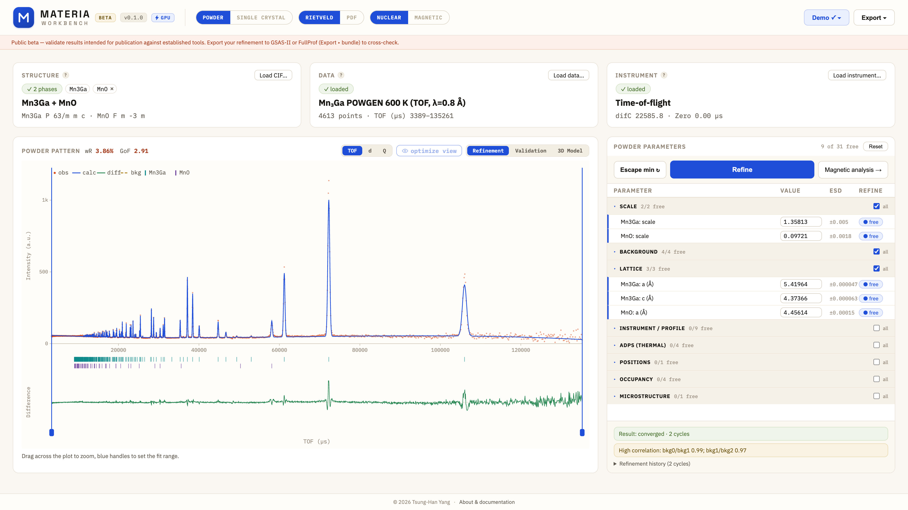

# MATERIA Workbench

[](https://drthyang.github.io/web-refinement/)
[](docs/LIMITATIONS.md)
[](LICENSE)
[](https://drthyang.github.io/web-refinement/)

**MATERIA — an AI-native foundation for materials science.** Crystal and magnetic
structure refinement that runs entirely in your browser, and is built from the
core up to be driven by LLM agents as well as by people. This is its web
workbench; the same pure core is exposed to agents as tools (see
[docs/AGENT_TOOLS.md](docs/AGENT_TOOLS.md)).

**▶ Try it in your browser: [drthyang.github.io/web-refinement](https://drthyang.github.io/web-refinement/)** — a
fully static GitHub Pages app; nothing to install, and your data never leaves
your machine.

<p align="center">
  
</p>
<p align="center"><sub>
A converged two-phase TOF Rietveld fit (Mn₃Ga + MnO impurity, POWGEN) in the
workbench. The screenshot is generated from the live app by
<code>scripts/device-screenshots.mjs</code>.
</sub></p>

## The vision: refinement an agent can reason about

Structure refinement is not a black-box optimization — it is an expert loop.
Never refine everything at once; watch parameter correlations; free only
symmetry-allowed parameters; judge the residuals, not just wR. Learning that
judgment is the hardest part of the field, and it is exactly the kind of
reasoning a language model can drive.

This workbench is designed for that from the ground up. Every scientific
capability lives in a pure, side-effect-free TypeScript core (`src/core/**`):
deterministic functions over plain, serializable data. The same functions that
back the UI buttons can therefore be exposed as **agent tools** (via MCP or
the Claude Agent SDK), and the expert procedures that compose them become
**skills** — one validated engine, whether you click the button or the agent
calls the tool. The engine already returns what an agent needs to think with —
parameter correlations, SVD near-null directions, at-bound flags — **not just
a scalar wR** — so an agent can run the same loop an expert runs by hand:

```
observe → decide → act → check
```

This agent layer is a **work in progress**: it ships incrementally as each
scientific milestone lands — never a wholesale "agent mode" bolted on at the
end. See
[docs/AGENT_TOOLS.md](docs/AGENT_TOOLS.md) for the tool/skill catalog and the
LLM-guided refinement design, and [docs/ROADMAP.md](docs/ROADMAP.md) for the
build sequence.

## The second goal: lowering the barrier to entry

Starting a Rietveld or single-crystal refinement today means choosing among
several mature packages — GSAS-II, Jana2020, FullProf, TOPAS, SHELX, Olex2 —
several of which handle both powder and single-crystal data. Each choice pulls
in its own ecosystem: its own data formats, its own instrument-parameter files,
its own split between single-crystal and powder workflows, and its own formalism
for magnetic structures (magnetic space groups in one, irreducible
representations in another). Some closed-source options are effectively
Windows-only, which puts them out of reach on Unix/Linux systems. None of this
is any package's fault — each grew deep to serve its facility and its
community, and they remain the tools of record that this project validates
against. But the combined effect is a steep on-ramp: a beginner faces many
consequential choices before ever seeing a first fit.

This project aims to lower that barrier:

- **Nothing to install.** A static web app that runs on any OS with a modern
  browser — Linux included. Live at
  [drthyang.github.io/web-refinement](https://drthyang.github.io/web-refinement/),
  or self-host the built `dist/`; the core workflow has no backend, so your data
  stays on your machine.
- **One workflow instead of four ecosystems.** Single-crystal and powder,
  X-ray and neutron (constant-wavelength and time-of-flight), nuclear and
  magnetic — one shared refinement engine, one UI.
- **Reads what you already have.** CIF/mCIF, hkl and FullProf `.int`
  reflection lists, plain-column / GSAS `.gsa`·FXYE / ILL powder data, and
  instrument files from GSAS-II (`.instprm`), classic GSAS (`.prm` INS/ICONS),
  and FullProf (`.irf` — CW Caglioti and TOF, plus the D2B/3T2/G4.2 `INSTRM=6`
  variant) — with format
  auto-detection that reports *how* each decision was made, lets you override
  it, and names the beamline · facility when the file identifies one.
- **Transparent by design.** A guided step-by-step procedure that starts from
  a small, safe set of choices; fit quality judged with F_obs vs F_calc and
  normal-probability plots, not wR alone. Every scientific function is pure,
  tested TypeScript you can read.
- **A bridge between magnetic formalisms.** A magnetic-space-group
  (Shubnikov/BNS) workflow today, with representation analysis being built
  alongside it — so both descriptions of the same physics live in one tool.

This is a complement to the established packages, not a replacement — see
[docs/COMPARISON.md](docs/COMPARISON.md) for an honest capability matrix.

> This package is an early browser-native refinement workbench for transparent
> model building, simulation, and basic constrained refinement. Results intended
> for publication must be validated against established tools and expert
> crystallographic judgment.

## Status

**Public beta.** A working app — atomic/nuclear refinement (single-crystal +
powder) plus a commensurate single-k magnetic workflow — and a first agent-tool
layer over the same core. The scientific core, Levenberg–Marquardt refinement
engine, symmetry-adapted constrained parameters, CIF parsing, a 3D
structure/moment viewer, plots, and Web Worker compute are implemented and
tested (**656 tests**). Crystallographic and scattering foundations are
validated against bundled GSAS-II refinements (see
[docs/REPORT.md](docs/REPORT.md) and [docs/VALIDATION.md](docs/VALIDATION.md)).
As with any beta, results intended for publication must be validated against
established tools ([docs/LIMITATIONS.md](docs/LIMITATIONS.md)).

**Agent tools (milestone 1):** an MCP server exposes the pure core to LLM agents
— parse → build → refine → **assess** (expert judgment: verdict, dangerous
correlations, at-bound/unphysical parameters, unexplained residual peaks) →
**suggest next steps** → **interpret** (materials reading). The judgment lives in
tested pure core (`src/core/diagnostics/`), so an agent reasons about a
refinement rather than just running it. See
[docs/AGENT_TOOLS.md](docs/AGENT_TOOLS.md).

The magnetic workflow runs end to end: **auto-detect magnetic peaks → k-vector
search → little-group magnetic subgroups → editable moment preview → moment
refinement** (k = 0 *and* k ≠ 0, CW and TOF, on one shared scale). Occupancy-
disorder sites refine with tied position/ADP, a Σ(occupancy) restraint (optionally
= 1), and an optional shared moment. Fit quality is judged with **F_obs vs F_calc
and normal-probability plots**, not just wR. Candidate magnetic groups carry
their standard **BNS/OG labels** (bundled ISO-MAG table). The star of k /
multi-k, representation analysis, and refined CIF/mCIF export are the next
milestones; see [docs/ROADMAP.md](docs/ROADMAP.md) and
[docs/LIMITATIONS.md](docs/LIMITATIONS.md).

The agent-tools layer and the LLM-guided refinement loop (the vision above)
are documented in [docs/AGENT_TOOLS.md](docs/AGENT_TOOLS.md) and ship
incrementally with each milestone.

## Commands

```bash
npm install     # install dependencies
npm run dev     # start the local dev server
npm run build   # type-check and build the static site
npm run test    # run the test suite (Vitest)
npm run test:ganb4se8  # required real-data powder regression
```

Use `npm run test:ganb4se8` for refinement-engine changes. It requires the local
`data/GaNb4Se8_XRD/` files and fails if they are missing; this dataset is the
primary real-data check because it exposes the current build's powder-refinement
failure modes much better than synthetic examples.

## Scope

Single-crystal and powder workflows sharing one refinement engine, for both
nuclear and magnetic structures:

- Load CIF structures, hkl reflection tables, and powder patterns.
- Compute nuclear and magnetic structure factors and intensities.
- Refine scale, coordinates, occupancies, displacement, lattice, background
  (Chebyshev / Fourier / lin+log interpolation), peak width, microstructure
  (crystallite size & microstrain, isotropic / uniaxial / generalized Mustrain),
  and magnetic moments — with fixed/free states, bounds, and constraints.
- Compare observed vs calculated, track refinement history, and export the
  refinement — a reproducible project JSON, or a one-click FullProf / GSAS-II
  cross-check bundle (control file + data + instrument, with your original
  instrument and data files included verbatim).

## Architecture in one paragraph

A static web app (React + TypeScript + Vite) with strict layering and
one-directional dependencies. `src/core/**` is **pure TypeScript** — no React,
DOM, or workers — so every scientific function is pure and independently
testable. UI components handle presentation only; long calculations run in Web
Workers, with WebAssembly/WebGPU as future accelerators. Full detail in
[docs/ARCHITECTURE.md](docs/ARCHITECTURE.md).

## Documentation

- [docs/ROADMAP.md](docs/ROADMAP.md) — **the single authoritative roadmap** (vision, foundations, milestones, agent layer)
- [docs/AGENT_TOOLS.md](docs/AGENT_TOOLS.md) — agent tools, skills, and the LLM-guided refinement plan
- [docs/ARCHITECTURE.md](docs/ARCHITECTURE.md) — layers, source tree, conventions
- [docs/DATA_MODEL.md](docs/DATA_MODEL.md) — data types and their reasoning
- [docs/REFINEMENT_ENGINE.md](docs/REFINEMENT_ENGINE.md) — the least-squares design
- [docs/SCATTERING_TABLES.md](docs/SCATTERING_TABLES.md) — neutron / X-ray / magnetic form-factor tables
- [docs/VALIDATION.md](docs/VALIDATION.md) — testing & external comparison strategy
- [docs/LIMITATIONS.md](docs/LIMITATIONS.md) — scope and known simplifications
- [docs/PROJECT_FORMAT.md](docs/PROJECT_FORMAT.md) — the project JSON format
- [docs/REFINEMENT_PROCEDURE.md](docs/REFINEMENT_PROCEDURE.md) — the guided 7-step workflow
- [docs/COMPARISON.md](docs/COMPARISON.md) — features vs GSAS-II / Jana2020 / FullProf
- [docs/REFERENCES.md](docs/REFERENCES.md) — bibliography: papers, data sources, and GSAS-II (validation reference)
- [docs/REPORT.md](docs/REPORT.md) — build & validation report
- [docs/archive/](docs/archive/) — superseded plans (POWDER_ROADMAP, MATURITY_PLAN), kept for detail

## License

[GNU Affero General Public License v3.0](LICENSE) (AGPL-3.0-only).

This is a web application: if you run a modified version on a network server, you must make the complete corresponding source code available to its users (AGPL §13).
