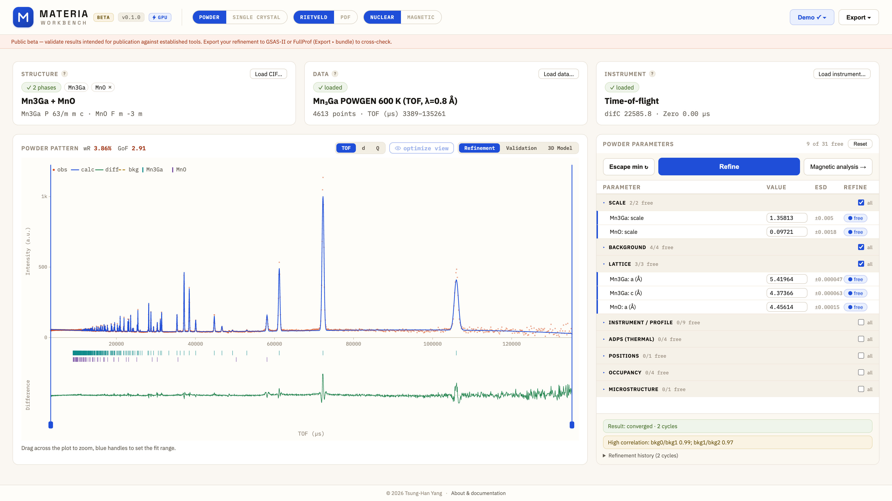

# MATERIA Workbench

[](https://drthyang.github.io/web-refinement/)
[](docs/LIMITATIONS.md)
[](LICENSE)
[](https://drthyang.github.io/web-refinement/)

**Crystal and magnetic structure refinement that runs entirely in your browser,
built to be driven by people and by AI agents.**

**▶ Try it: [drthyang.github.io/web-refinement](https://drthyang.github.io/web-refinement/)** —
nothing to install, and your data never leaves your machine. Two demos open
already converged: a two-phase Mn₃Ga neutron TOF Rietveld fit and a GaTa₄Se₈
X-ray PDF fit.

<p align="center">
  
</p>

## Goals

- **Refinement an agent can reason about.** Refinement is an expert loop, not a
  black box: free only symmetry-allowed parameters, watch correlations, judge the
  residuals. Every scientific function lives in a pure TypeScript core, so the
  same engine backs the UI buttons and the MCP agent tools. It returns what an
  agent needs to think with — correlations, near-null directions, at-bound
  flags — not just a scalar wR. See [docs/AGENT_TOOLS.md](docs/AGENT_TOOLS.md).
- **One workflow, nothing to install.** Powder and single crystal, X-ray and
  neutron (constant-wavelength and time-of-flight), nuclear and magnetic,
  reciprocal and real space: one engine, one UI, on any OS with a browser. It
  reads the files you already have and complements GSAS-II, Jana2020 and
  FullProf rather than replacing them. See [docs/COMPARISON.md](docs/COMPARISON.md).
- **Transparent by design.** Fit quality is judged with F_obs vs F_calc and
  normal-probability plots, not wR alone. Every result is cross-checked against
  established tools where possible, and the code is readable, tested TypeScript.
  See [docs/VALIDATION.md](docs/VALIDATION.md).

## Features

| Track | What you get | Read more |
| --- | --- | --- |
| **Powder Rietveld** | CW and TOF, multi-phase, background, peak shape, microstructure; GSAS-II, GSAS and FullProf instrument files; one-click FullProf / GSAS-II cross-check bundle | [User guide](docs/USER_GUIDE.md) |
| **Magnetic structures** | Detect magnetic peaks → k-vector search → magnetic subgroups with BNS/OG labels → moment refinement; k = 0, commensurate and incommensurate single-k; mCIF export | [Magnetic symmetry](docs/MAGNETIC_SYMMETRY.md) |
| **Single crystal** | F² refinement from hkl, SHELX HKL and FullProf `.int` lists, with absorption correction | [Single crystal](docs/SINGLE_CRYSTAL.md) |
| **PDF and mPDF** | Neutron and X-ray G(r), multi-phase and multi-dataset, boxcar scans across r, symmetry-mode distortions, magnetic PDF; validated against PDFfit2 and diffpy.mpdf | [PDF roadmap](docs/PDF_MPDF_ROADMAP.md) |
| **Uncertainty** | Levenberg–Marquardt esds plus Bayesian posterior sampling (ensemble MCMC and NUTS) with convergence diagnostics | [Refinement engine](docs/REFINEMENT_ENGINE.md) |
| **Agent tools** | An MCP server over the same core: parse → build → refine → assess → suggest → interpret | [Agent tools](docs/AGENT_TOOLS.md) |
| **Files** | Reads CIF/mCIF, hkl, `.int`, GSAS/FXYE/ILL/plain powder data, `.gr`/`.sq`/`.fq`; writes CIF/mCIF with esds, an HTML report, and a reopenable project file | [Project format](docs/PROJECT_FORMAT.md) |

## Status

**Public beta.** Results intended for publication must be validated against
established tools and expert judgment; what is supported, approximate, or
missing is listed in [docs/LIMITATIONS.md](docs/LIMITATIONS.md). Next up: the
star of k and multi-k structures, full representation analysis, and a
symmetry-constrained local-spin model for mPDF. The build order is in
[docs/ROADMAP.md](docs/ROADMAP.md).

## Develop

```bash
npm install
npm run dev
npm run test
```

Build, lint, the real-data regression, and the layering rules are in
[docs/ARCHITECTURE.md](docs/ARCHITECTURE.md).

## Documentation

The full index, grouped by what you want to do, is
[docs/README.md](docs/README.md). Start with the
[user guide](docs/USER_GUIDE.md), and read the
[limitations](docs/LIMITATIONS.md) before you rely on a result.

## License

[GNU Affero General Public License v3.0](LICENSE). If you run a modified
version on a network server, you must make its source available to its users
(AGPL §13).

*This project is personal work, developed and maintained in my personal capacity.*
